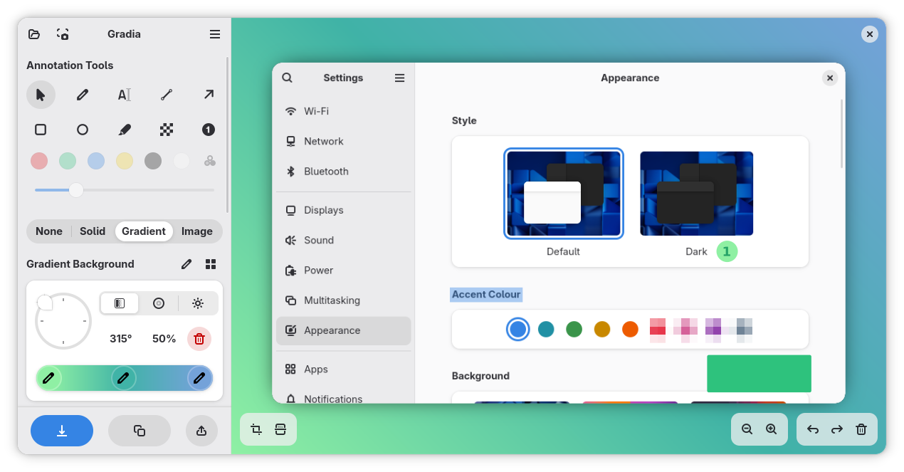
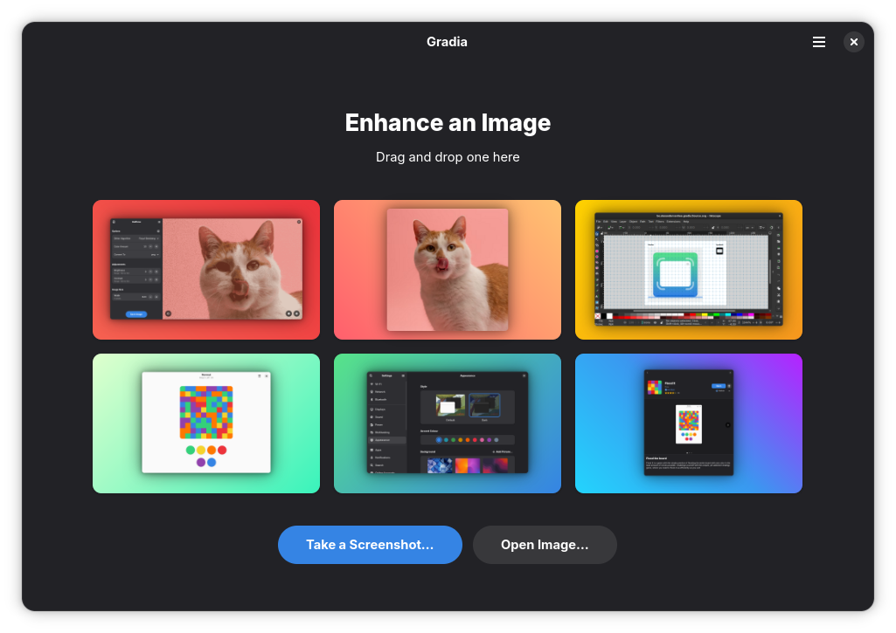

<p align="center">
  
</p>

<h1 align="center">Gradia</h1>
<p align="center"><em>Make your screenshots ready for the world.</em></p>

<p align="center">
  On social media, it's often hard to control how your images appear to others.
  Transparent or oddly sized images—like screenshots—often don't display well.
  Fixing these issues can feel like more trouble than it's worth.
</p>

<p align="center">
  Gradia aims to alleviate that problem by allowing you to quickly edit images to address these issues,
  while also offering options to enhance their overall appearance.
</p>

<div align="center">
  <div style="display: flex; flex-wrap: wrap; justify-content: center; gap: 1em;">
    <a href="https://flathub.org/apps/be.alexandervanhee.gradia">
      
    </a>
    <a href="https://snapcraft.io/gradia">
      
    </a>
  </div>
</div>

<div align="center">
    <a href="https://ko-fi.com/alexandervanhee">
        
    </a>
</div>

---
<p align="center" style="display: flex; justify-content: center; gap: 1em; flex-wrap: wrap;">
  
  
  
  
</p>


Gradia allows you to quickly modify screenshots of application windows to put them better in context.

> [!IMPORTANT]
> The [GNOME Code of Conduct](https://conduct.gnome.org) applies to this project, including this repository.
## Automatically Open the App After Taking a Screenshot

If you'd like Gradia to **open automatically** after taking a screenshot, you can set up a custom keyboard shortcut:

1. Go to **Settings** → **Keyboard** → **View and Customize Shortcuts** → **Custom Shortcuts**.
2. Click the **+** button to create a new shortcut.
3. Set the **Name** to something like *Open Gradia with Screenshot*.
4. For the **Command**, enter:

   ```
   flatpak run be.alexandervanhee.gradia --screenshot=INTERACTIVE
   ```
   (You can also use `--screenshot=FULL` to take a screenshot of all existing screens instantly.)
5. Assign a keyboard shortcut of your choice (`Ctrl + Print` should be free by default).

## Screenshots

<div align="center" style="display: flex; justify-content: center; align-items: center; gap: 5%;">
  
  
</div>


## Unofficial packages
> [!WARNING]
> These methods are not officially supported. Issues related to packaging in these methods should be reported outside this project's bug tracker.

[](https://repology.org/project/gradia/versions)

## How to build

### GNOME Builder

1. Install Builder from [Flathub](https://flathub.org/apps/org.gnome.Builder).
2. Click the **Clone Repository** button at the bottom right and enter the repository URL.
3. Once cloned, locate the dropdown menu next to the `be.alexandervanhee.gradia.json` text at the top of the screen.
4. In the dropdown, use the **Active Configuration** option to select either the *Devel* Flatpak build file or the regular one, then press the **Run** button.
   The *Devel* configuration includes everything required for OCR.

